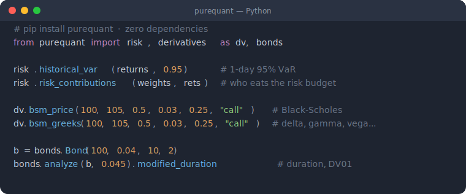

# purequant

[](https://github.com/oratis/purequant/actions/workflows/ci.yml)
[](https://pypi.org/project/purequant/)
[](https://pypi.org/project/purequant/)
[](https://creativecommons.org/licenses/by-nc/4.0/)

**A quantitative-finance toolkit written in 100% pure Python — no numpy, no pandas, no C extensions.**

Every function takes plain `list` / `dict` and depends only on the standard library.
That makes `purequant` trivial to vendor, audit, run in restricted/offline
environments, teach from, or drop into a lambda — and easy to swap for numpy later
(the interfaces don't change). Sized for personal-to-desk-scale portfolios at
daily frequency.

```bash
pip install purequant
```



## Why

- **Zero dependencies.** One `pip install`, no build tools, works anywhere Python runs.
- **Readable.** Each formula is a short, documented function you can actually read.
- **Traceable.** Deterministic, list-in/number-out — great for teaching and for
  agents/LLMs that must cite where a number came from.
- **Broad coverage.** Risk, options, bonds, futures, hedging, factors, attribution,
  optimization and backtesting in one small package.

## Features

| Module | What it does |
|--------|--------------|
| `risk` | annualised volatility, historical & parametric **VaR / CVaR**, drawdown, beta, **Euler risk contributions** |
| `derivatives` | **Black-Scholes-Merton** price, full Greeks (Δ Γ Vega Θ ρ), implied vol |
| `bonds` | price ↔ **YTM**, Macaulay & modified **duration**, **convexity**, DV01 |
| `futures` | cost-of-carry fair value, basis, roll yield, index-futures hedge sizing |
| `optimize` | **min-variance**, mean-variance, **risk parity** (with weight caps) |
| `hedge` | beta hedge, min-variance hedge ratio, **pairs / cointegration** screen |
| `factor` | multi-factor scoring, cross-sectional z-scoring, sector neutralise, IC |
| `attribution` | **factor (regression)** & **Brinson** sector attribution |
| `backtest` | rebalanced & cross-sectional **momentum** backtests with costs |
| `stats` / `linalg` | cov/corr, OLS, shrinkage, quantiles; Gaussian solve, inverse, PSD ridge |

## Quick start

```python
from purequant import risk, derivatives as dv, bonds, optimize

# Value at Risk / CVaR from a daily return series
returns = [-0.012, 0.008, 0.021, -0.031, 0.004, -0.018, 0.016]
risk.historical_var(returns, confidence=0.95)   # 1-day 95% VaR (positive loss)
risk.cvar(returns, confidence=0.95)              # expected shortfall

# Black-Scholes-Merton option price + Greeks
dv.bsm_price(spot=100, strike=105, t=0.5, r=0.03, sigma=0.25, right="call")
g = dv.bsm_greeks(100, 105, 0.5, 0.03, 0.25, "call")
g.delta, g.gamma, g.vega, g.theta

# Bond analytics
b = bonds.Bond(face=100, coupon_rate=0.04, years_to_maturity=10, freq=2)
r = bonds.analyze(b, ytm=0.045)
r.modified_duration, r.convexity, r.dv01

# Minimum-variance portfolio from a covariance matrix
cov = [[0.04, 0.006, 0.0], [0.006, 0.09, 0.0], [0.0, 0.0, 0.01]]
optimize.min_variance(cov, ["A", "B", "C"])

# Euler risk contributions — which position eats the risk budget?
rc = risk.risk_contributions({"A": 0.6, "B": 0.4},
                             {"A": returns, "B": [x * 0.8 for x in returns]})
rc.contributions   # shares that sum to ~1
```

## Scope & limitations

- **Precision/scale.** Pure-Python loops are fine for tens–hundreds of assets at
  daily frequency. For large panels or high-frequency data, use numpy — the list
  interfaces make the swap local.
- **Analytics, not order routing.** `purequant` computes numbers and *suggestions*;
  it never connects to a broker or places trades.
- Bond day-count is simplified (periodic coupons); options are European BSM.
  See each module's docstring for assumptions.

## Development

```bash
git clone https://github.com/oratis/purequant
cd purequant
python -m unittest discover -s tests   # pure-stdlib tests, no deps needed
```

## License

**Creative Commons Attribution-NonCommercial 4.0 International (CC BY-NC 4.0).**
Free to use, modify and share **for non-commercial purposes** with attribution.
For commercial use, please contact the author. See [LICENSE](LICENSE).

> Note: CC BY-NC is a *source-available, non-commercial* license, not an
> OSI-approved open-source license.
